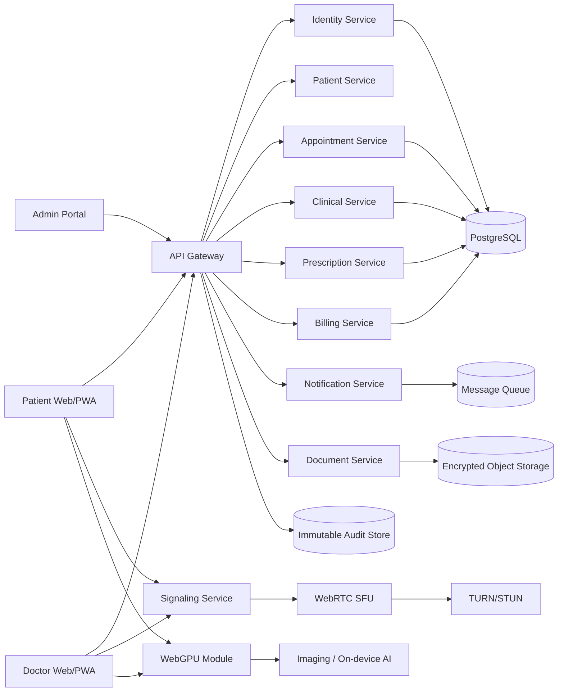
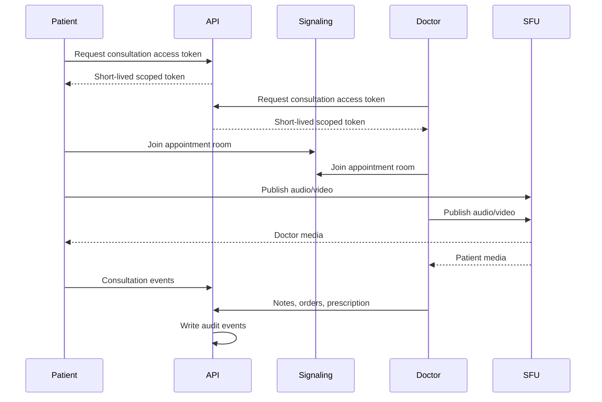
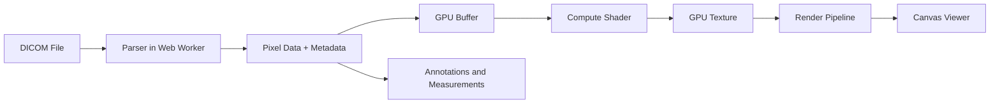
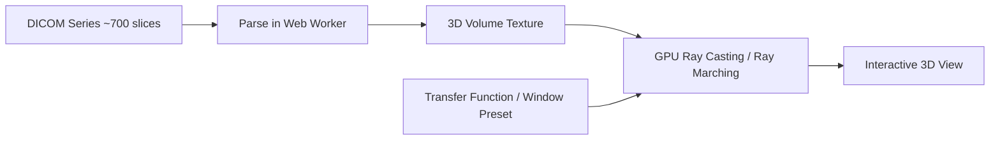
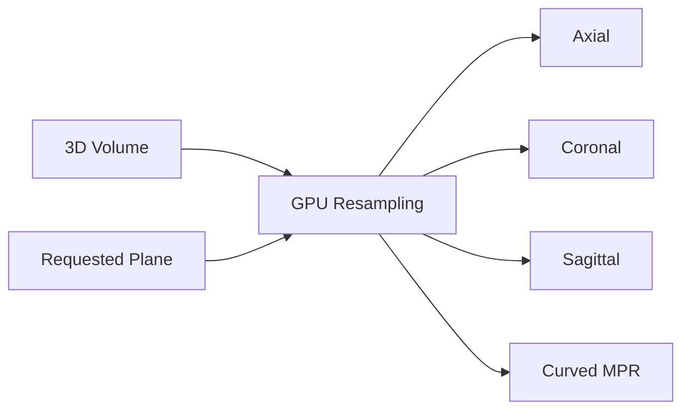
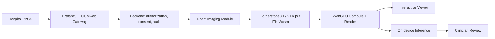
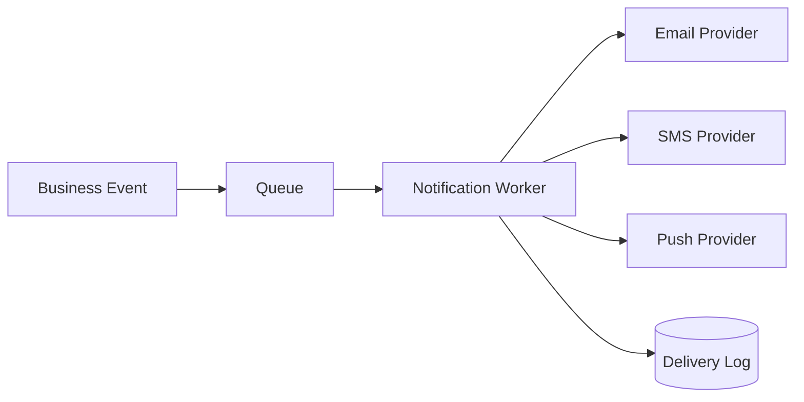
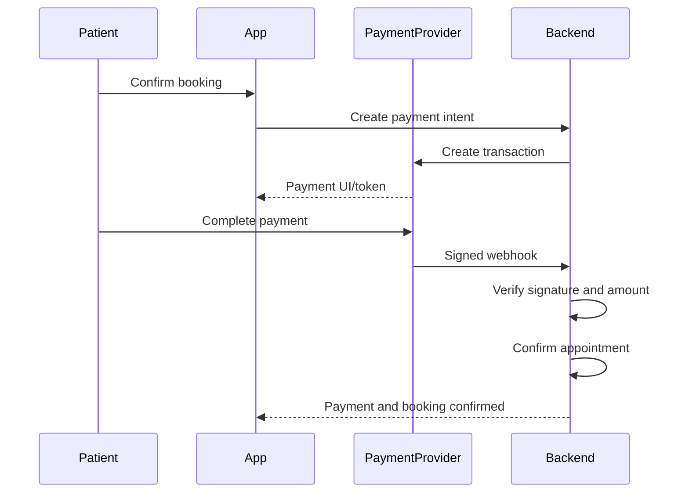
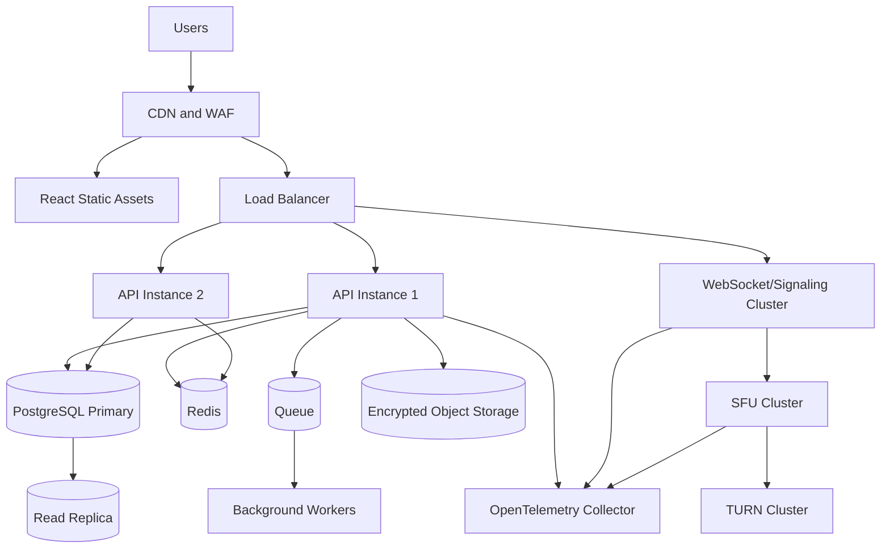

# Telemedicine Application Development Blueprint
## React + WebRTC + WebGPU

> **Document purpose:** A comprehensive technical and product blueprint for building a secure, scalable telemedicine platform using React for the web application, WebRTC for real-time consultations, and WebGPU for high-performance image processing, medical visualization, signal processing, and optional on-device AI inference.
>
> **Important:** This is a software-development blueprint, not medical or legal advice. Healthcare regulations, prescribing rules, data-retention requirements, clinician licensing, and telemedicine permissions vary by country and jurisdiction. Obtain professional legal, clinical, privacy, and cybersecurity review before production deployment.

---

## Table of Contents

1. [Executive Summary](#1-executive-summary)
2. [Product Vision](#2-product-vision)
3. [Why React, WebRTC, and WebGPU](#3-why-react-webrtc-and-webgpu)
4. [Scope and User Roles](#4-scope-and-user-roles)
5. [Functional Modules](#5-functional-modules)
6. [Recommended Architecture](#6-recommended-architecture)
7. [Technology Stack](#7-technology-stack)
8. [Frontend Architecture](#8-frontend-architecture)
9. [Backend Architecture](#9-backend-architecture)
10. [Real-Time Consultation Architecture](#10-real-time-consultation-architecture)
11. [WebGPU Architecture](#11-webgpu-architecture)
12. [FHIR-Based Healthcare Data Model](#12-fhir-based-healthcare-data-model)
13. [Database Design](#13-database-design)
14. [API Design](#14-api-design)
15. [Authentication and Authorization](#15-authentication-and-authorization)
16. [Security, Privacy, and Compliance](#16-security-privacy-and-compliance)
17. [Clinical Safety and AI Governance](#17-clinical-safety-and-ai-governance)
18. [UI and UX Design](#18-ui-and-ux-design)
19. [Notification and Communication System](#19-notification-and-communication-system)
20. [Prescription and Medication Workflow](#20-prescription-and-medication-workflow)
21. [Laboratory and Diagnostic Workflow](#21-laboratory-and-diagnostic-workflow)
22. [Payment and Billing](#22-payment-and-billing)
23. [Deployment Architecture](#23-deployment-architecture)
24. [Observability and Auditability](#24-observability-and-auditability)
25. [Testing Strategy](#25-testing-strategy)
26. [DevOps and CI/CD](#26-devops-and-cicd)
27. [Performance and Scalability](#27-performance-and-scalability)
28. [Offline and Low-Bandwidth Support](#28-offline-and-low-bandwidth-support)
29. [Implementation Roadmap](#29-implementation-roadmap)
30. [Team Structure](#30-team-structure)
31. [Risk Register](#31-risk-register)
32. [Suggested Repository Structure](#32-suggested-repository-structure)
33. [Starter Code Examples](#33-starter-code-examples)
34. [Definition of Done](#34-definition-of-done)
35. [Production Readiness Checklist](#35-production-readiness-checklist)
36. [References](#36-references)

---

# 1. Executive Summary

The proposed platform is a browser-based telemedicine application connecting patients, doctors, nurses, diagnostic centers, pharmacies, administrators, and support teams.

The system should provide:

- Patient registration and identity verification.
- Doctor discovery and appointment scheduling.
- Secure audio/video consultation.
- Electronic medical records and encounter notes.
- Electronic prescriptions.
- Laboratory and diagnostic report exchange.
- Medical image viewing and enhancement.
- Payment, invoices, refunds, and settlement reporting.
- Notifications and reminders.
- Consent management.
- Full audit trails.
- Optional AI-assisted workflows with human review.

The recommended division of responsibility is:

| Technology | Primary responsibility |
|---|---|
| React | User interfaces, workflows, dashboards, forms, state management |
| WebRTC | Real-time audio, video, screen sharing, and consultation data channels |
| WebGPU | High-performance medical image rendering, filtering, signal processing, visualization, and optional local AI inference |
| Backend API | Business rules, authorization, patient records, appointments, billing, audit, integrations |
| Media server/SFU | Reliable multi-party calls, recording, quality adaptation, and enterprise-scale consultations |
| Object storage | Reports, prescriptions, images, consent files, recordings, and attachments |

WebGPU must be treated as an enhancement. Core consultations, prescriptions, appointments, and records must continue working when WebGPU is unavailable.

---

# 2. Product Vision

## 2.1 Vision Statement

Create a secure digital healthcare platform that enables patients to receive remote clinical services while giving healthcare professionals a complete, auditable, and efficient workflow for consultation, diagnosis support, treatment planning, follow-up, and referral.

## 2.2 Primary Objectives

1. Reduce patient travel and waiting time.
2. Improve access to qualified clinicians.
3. Maintain reliable longitudinal patient records.
4. Support low-bandwidth and mobile users.
5. Improve consultation quality through structured clinical workflows.
6. Accelerate medical-image review using browser GPU processing.
7. Integrate safely with hospitals, laboratories, pharmacies, and payment providers.
8. Protect sensitive health information through privacy-by-design.

## 2.3 Non-Goals for the Initial Release

The first release should not attempt to become:

- A fully autonomous diagnostic system.
- A replacement for emergency services.
- A complete hospital ERP.
- A national health-information exchange.
- A general-purpose PACS replacement.
- A medical-device product without the necessary regulatory process.

---

# 3. Why React, WebRTC, and WebGPU

## 3.1 React

React is suitable for a telemedicine portal because the application contains many reusable and stateful interfaces:

- Appointment calendars.
- Patient charts.
- Video rooms.
- Prescription editors.
- Medical report viewers.
- Doctor dashboards.
- Admin approval screens.
- Real-time notifications.

Use TypeScript with React to reduce runtime errors in complex healthcare workflows.

## 3.2 WebRTC

WebRTC is the browser platform for real-time audio, video, screen sharing, and peer data exchange.

It should handle:

- Doctor-to-patient audio/video.
- Camera and microphone access.
- Screen sharing.
- Network quality statistics.
- Device switching.
- Optional real-time chat through RTCDataChannel.

For production, prefer an SFU-based architecture rather than direct peer-to-peer calls for every case.

## 3.3 WebGPU

WebGPU provides browser access to modern GPU graphics and compute capabilities. It is not a replacement for WebRTC. Unlike WebGL, which is oriented toward rasterized graphics, WebGPU exposes general-purpose compute shaders, which is what makes it applicable to medical image processing and on-device inference rather than display alone.

### 3.3.1 Why Medical Imaging Needs GPU Computing

Medical studies are large enough that per-pixel work on the CPU becomes visibly slow in a browser tab. Typical study sizes:

| Imaging type | Typical size |
|---|---|
| X-ray | 3–20 MB |
| CT scan | 500 MB–5 GB |
| MRI | 1–10 GB |
| PET scan | 2–8 GB |
| Digital pathology slide | 2–50 GB |
| 3D ultrasound | Hundreds of MB |

These figures are the reason WebGPU appears in this blueprint at all. A workflow that only ever displays a single small JPEG report does not need a GPU path. A workflow where a clinician scrolls a CT series, adjusts window/level continuously, or reconstructs an arbitrary plane does, because each interaction reprocesses the full pixel set at interactive frame rates.

Note that study size also constrains the design: a multi-gigabyte study cannot simply be loaded into browser memory. Streaming, progressive loading, and per-series limits are required regardless of whether WebGPU is available. See [11.9 WebGPU Privacy and Resource Controls](#119-webgpu-privacy-and-resource-controls).

### 3.3.2 Where WebGPU Is Suited in Telemedicine

The following uses are appropriate for GPU acceleration in this platform. Each remains subject to the fallback rule in [11.1 Design Principle](#111-design-principle) and, where clinical meaning is involved, to [17. Clinical Safety and AI Governance](#17-clinical-safety-and-ai-governance).

**Viewing and interaction**

- DICOM image windowing and leveling, recomputed per frame in a shader instead of per pixel on the CPU.
- Zooming, panning, rotation, flip, and annotation overlays.
- Smooth series scrolling and cine playback.
- Color-map and heat-map rendering (perfusion, blood flow, functional MRI, PET uptake).

**Image processing**

- Contrast enhancement, including CLAHE.
- Denoising (median, Gaussian, bilateral, non-local means).
- Edge enhancement (Sobel, Laplacian), sharpening, and blurring.
- Ultrasound and radiology frame processing.

**Volumetric and reconstructed views**

- 3D volume visualization by GPU ray casting over a stacked series — a several-hundred-slice CT reconstructed into an interactive volume.
- Multi-planar reconstruction: generating axial, coronal, and sagittal planes on demand from one volume rather than loading separate image sets.
- Curved MPR for dental CT, coronary arteries, and other vessels.
- Maximum intensity projection for CTA, MRA, and vessel imaging; minimum intensity projection for lung and airway visualization.
- Image fusion such as PET/CT or MRI/CT.
- Multi-sequence MRI visualization (T1, T2, FLAIR, DWI, ADC, SWI) combined interactively.

**Signal processing**

- ECG and other biosignal waveform rendering and filtering. See [11.6 ECG and Biosignal Processing](#116-ecg-and-biosignal-processing).

**On-device inference**

- ONNX model inference through the WebGPU execution provider, keeping pixel data on the patient's or clinician's device rather than sending it to an inference server. See [11.7 On-Device AI with ONNX Runtime Web](#117-on-device-ai-with-onnx-runtime-web).
- Segmentation overlay rendering, where a mask produced by a model is composited over the original image as a separate layer.

**Consultation media**

- Background blur or privacy masking on the local video track.

### 3.3.3 Relative Performance Characteristics

The following is a qualitative guide for deciding where a GPU path is worth building, not a benchmark. Measure on your own target hardware before committing to a design.

| Task | CPU | WebGL | WebGPU |
|---|---|---|---|
| 2D viewer | Medium | Fast | Very fast |
| DICOM rendering | Medium | Fast | Excellent |
| Image filtering | Slow | Fast | Very fast |
| 3D volume rendering | Slow | Good | Excellent |
| MPR | Slow | Good | Excellent |
| Segmentation | Slow | Moderate | Excellent |
| AI inference | Poor | Limited | Excellent |
| Compute shader support | n/a | No | Yes |

The decisive row is the last one. Where WebGL can only approximate compute work through fragment shaders and texture tricks, WebGPU expresses it directly, which is why inference and segmentation show the largest gap.

### 3.3.4 Suitability by Clinical Domain

| Medical domain | WebGPU use |
|---|---|
| Radiology | DICOM viewing, CT/MRI rendering, MPR |
| Cardiology | CTA, vessel analysis, 3D heart visualization |
| Oncology | Tumor segmentation, PET/CT fusion |
| Neurology | Brain MRI visualization, lesion detection |
| Orthopedics | Bone reconstruction and surgical planning |
| Dentistry | CBCT rendering and curved MPR |
| Pathology | Whole-slide image rendering and AI-assisted analysis |
| Telemedicine | Browser-based diagnostic viewers with integrated AI |

Note that the later rows in this table describe capabilities that carry regulatory weight. Segmentation, lesion detection, and surgical planning are not merely rendering features; where they inform a clinical decision they may constitute a medical device. Treat this table as a map of what is technically suited to WebGPU, and [17.5 Medical Device Boundary](#175-medical-device-boundary) as the gate on what this platform may actually ship.

### 3.3.5 Established Imaging Libraries

Do not implement a DICOM viewer from first principles. The following are the established options and should be evaluated before writing custom pipelines:

- **Cornerstone3D** — DICOM viewport, tools, annotations, and volume support.
- **VTK.js** — general scientific visualization, volume rendering, MPR.
- **ITK-Wasm** — image processing and file-format handling compiled to WebAssembly.
- **OHIF Viewer** — a full viewer application, useful as a reference or an embedded component.
- **DICOMweb** — the interoperability path to PACS. See [21.3 Medical Imaging](#213-medical-imaging).

Custom WGSL is justified where a library lacks a specific operation or where profiling shows its path is the bottleneck, not as a default.

### 3.3.6 Constraints to Plan For

- Browser support is improving but is not universal; older browsers and devices will not have WebGPU.
- Performance depends on the user's GPU and graphics drivers, which vary widely across the patient device population.
- Large studies require streaming or progressive loading regardless of GPU acceleration.
- WGSL and GPU programming are specialist skills. Confirm the team has or can hire them before committing to a custom pipeline. See [30. Team Structure](#30-team-structure).

## 3.4 When Not to Use WebGPU

Do not use WebGPU for:

- Appointment CRUD operations.
- Normal forms and tables.
- Authentication.
- Basic video transport.
- Database access.
- Business rules.
- Anything that must work on all devices without fallback.

---

# 4. Scope and User Roles

## 4.1 Patient

- Register and verify identity.
- Manage profile, dependents, allergies, and medical history.
- Search doctors by specialty, location, language, gender preference, fee, or availability.
- Book, reschedule, or cancel appointments.
- Upload reports and medical images.
- Join consultations.
- Receive prescriptions and care plans.
- Pay fees.
- View medical history.
- Request follow-up or referrals.
- Manage consent and privacy settings.

## 4.2 Doctor

- Manage professional profile, credentials, specialties, fees, and schedule.
- Review patient history before consultation.
- Conduct video consultation.
- Record clinical notes.
- Enter symptoms, diagnosis, observations, and treatment plan.
- Create electronic prescriptions.
- Request tests.
- Refer patients.
- Schedule follow-ups.
- Review uploaded reports and images.
- Sign and finalize encounter documents.

## 4.3 Nurse or Clinical Assistant

- Perform pre-consultation triage.
- Capture vital signs.
- Verify documents.
- Place patients in a waiting room.
- Escalate urgent symptoms to approved workflows.
- Assist clinicians during consultations.

## 4.4 Diagnostic Center

- Receive test orders.
- Confirm appointments.
- Upload structured results and signed reports.
- Submit imaging files.
- Mark sample collection and processing status.

## 4.5 Pharmacy

- Receive valid prescriptions when patient consent permits.
- Verify prescription authenticity.
- Mark fulfillment status.
- Record substitutions only when legally and clinically permitted.

## 4.6 Administrator

- Manage users, providers, specialties, fees, availability, and service areas.
- Verify clinician credentials.
- Manage complaints and refunds.
- Review audit events.
- Configure policies, notification templates, and integrations.
- Monitor service quality and operational metrics.

## 4.7 Compliance or Auditor Role

- Read audit records.
- Review consent history.
- Review access to sensitive records.
- Export compliance evidence.
- Investigate suspicious access.

## 4.8 Support Agent

- Assist with non-clinical issues.
- View only the minimum necessary patient and appointment data.
- Never edit clinical notes or prescriptions.

---

# 5. Functional Modules

## 5.1 Identity and Account Management

- Email or mobile registration.
- OTP verification.
- Passwordless login option.
- MFA for doctors and administrators.
- Identity-document verification.
- Device and session management.
- Account recovery.
- Guardian/dependent relationships.

## 5.2 Provider Management

- Provider onboarding.
- License and certificate upload.
- Credential review.
- Specialty mapping.
- Schedule and time-zone settings.
- Consultation fees.
- Clinic affiliations.
- Availability status.
- Credential expiration alerts.

## 5.3 Appointment Management

- Doctor schedule templates.
- Slot generation.
- Buffer time between appointments.
- Overbooking policy.
- Patient booking.
- Rescheduling and cancellation.
- Waiting list.
- Appointment reminders.
- No-show tracking.
- Time-zone conversion.

## 5.4 Virtual Waiting Room

- Device test.
- Consent confirmation.
- Symptoms questionnaire.
- Uploaded-document check.
- Estimated waiting time.
- Nurse triage status.
- Doctor-ready notification.

## 5.5 Consultation Room

- Audio and video.
- Mute/unmute.
- Camera selection.
- Microphone selection.
- Speaker selection where supported.
- Screen sharing.
- Secure text chat.
- File transfer through controlled backend upload.
- Network quality display.
- Consultation timer.
- Clinical note panel.
- Patient history panel.
- Prescription panel.
- End-consultation confirmation.

## 5.6 Electronic Health Record

- Patient demographics.
- Encounter timeline.
- Problems and diagnoses.
- Allergies.
- Medications.
- Vital signs.
- Laboratory results.
- Diagnostic reports.
- Procedures.
- Immunizations where applicable.
- Care plans.
- Referrals.
- Attachments.

## 5.7 Prescription Module

- Medication selection.
- Strength, route, frequency, duration, and quantity.
- Clinical instructions.
- Allergy and interaction alerts from approved data sources.
- Draft, sign, amend, cancel, and dispense statuses.
- Doctor digital signature.
- QR or verification code.
- PDF generation.
- Immutable signed version.

## 5.8 Diagnostic Orders

- Laboratory order.
- Imaging order.
- Home collection request.
- Priority level.
- Clinical reason.
- Order status tracking.
- Structured result upload.
- Doctor acknowledgement.

## 5.9 Billing

- Consultation pricing.
- Discounts and promotional rules.
- Payment intent.
- Payment confirmation.
- Invoice.
- Refund.
- Provider settlement.
- Tax or VAT fields based on jurisdiction.

## 5.10 Administration and Reporting

- Appointment volume.
- Revenue.
- Doctor utilization.
- No-show rate.
- Average waiting time.
- Call quality.
- Prescription volume.
- Follow-up compliance.
- Diagnostic turnaround time.
- Security events.
- Consent withdrawals.

---

# 6. Recommended Architecture

## 6.1 Logical Architecture



## 6.2 Deployment Style

A modular monolith is usually the best starting point.

Use a modular monolith when:

- The team is fewer than approximately 15 engineers.
- Product requirements are still evolving.
- One organization owns the platform.
- Operational simplicity is important.

Move selected modules to microservices when there is a measured need, such as:

- Media/signaling scaling independently.
- Billing isolation.
- Notification throughput.
- Heavy image processing.
- National or multi-tenant deployment.

## 6.3 Recommended Initial Components

1. React patient portal.
2. React provider portal.
3. React admin portal.
4. Backend application API.
5. WebSocket signaling service.
6. SFU media server.
7. PostgreSQL.
8. Redis.
9. Object storage.
10. Background worker.
11. Message broker.
12. Audit/event pipeline.
13. Monitoring stack.

---

# 7. Technology Stack

## 7.1 Frontend

| Area | Recommendation |
|---|---|
| Framework | React + TypeScript |
| Build tool | Vite |
| Routing | React Router |
| Server state | TanStack Query |
| Client state | Zustand or Redux Toolkit |
| Forms | React Hook Form |
| Validation | Zod |
| UI system | MUI, Ant Design, or a custom accessible design system |
| Internationalization | i18next |
| Charts | ECharts, Recharts, or D3 where necessary |
| Video | Native WebRTC APIs or an SFU vendor/client SDK |
| WebGPU | Native WebGPU, ONNX Runtime Web, or a WebGPU abstraction |
| Medical imaging | Cornerstone3D, VTK.js, ITK-Wasm, or OHIF Viewer; DICOMweb for PACS retrieval |
| Testing | Vitest, React Testing Library, Playwright |
| PWA | Workbox or Vite PWA plugin |

## 7.2 Backend Options

### Option A: Node.js

- NestJS or Fastify.
- TypeScript end to end.
- Socket.IO or native WebSocket signaling.
- Prisma or TypeORM.

### Option B: Python

- Django + Django REST Framework.
- Django Channels for signaling or notifications.
- Celery workers.
- Strong admin and mature ORM.

### Option C: .NET

- ASP.NET Core.
- SignalR.
- Entity Framework Core.
- Good fit for Microsoft-centered enterprises.

## 7.3 Data and Infrastructure

| Component | Recommended technology |
|---|---|
| Transactional database | PostgreSQL |
| Cache/session/rate limit | Redis |
| Object storage | S3-compatible storage |
| Search | OpenSearch or PostgreSQL full-text search |
| Queue | RabbitMQ, Kafka, or managed queue |
| Logs | OpenTelemetry + Loki/ELK |
| Metrics | Prometheus + Grafana |
| Tracing | OpenTelemetry + Tempo/Jaeger |
| Secrets | Vault or cloud secret manager |
| Containers | Docker |
| Orchestration | Kubernetes when scale justifies it |

## 7.4 Media Infrastructure Options

- Self-hosted SFU such as LiveKit, mediasoup, or Janus.
- Managed telehealth/video provider when compliance contracts and data residency are acceptable.
- TURN service such as coturn.

Do not depend only on public STUN. Many hospital, corporate, and mobile networks require TURN relay.

---

# 8. Frontend Architecture

## 8.1 Feature-Based Structure

```text
src/
├── app/
│   ├── App.tsx
│   ├── router.tsx
│   ├── providers.tsx
│   └── config.ts
├── assets/
├── components/
│   ├── common/
│   ├── forms/
│   ├── layout/
│   └── feedback/
├── features/
│   ├── auth/
│   ├── appointments/
│   ├── consultation/
│   ├── patients/
│   ├── providers/
│   ├── clinical-records/
│   ├── prescriptions/
│   ├── diagnostics/
│   ├── billing/
│   ├── notifications/
│   ├── imaging/
│   └── administration/
├── hooks/
├── lib/
│   ├── api/
│   ├── auth/
│   ├── webgpu/
│   ├── webrtc/
│   ├── fhir/
│   └── observability/
├── pages/
├── schemas/
├── styles/
├── types/
└── workers/
```

## 8.2 Component Boundaries

Keep clinical and infrastructure components separate.

Example:

```text
ConsultationPage
├── VideoRoom
│   ├── LocalVideo
│   ├── RemoteVideo
│   ├── DeviceSelector
│   ├── CallControls
│   └── NetworkQualityIndicator
├── PatientSummaryPanel
├── ClinicalNoteEditor
├── PrescriptionComposer
├── DiagnosticOrderComposer
└── ConsultationCompletionDialog
```

## 8.3 State Management Rules

Use server-state tools for:

- Appointments.
- Patient data.
- Prescriptions.
- Reports.
- Provider schedules.

Use local/global UI state for:

- Current sidebar state.
- Active video device.
- Draft note panel visibility.
- WebGPU availability.
- Call-control state.

Do not copy every API response into Redux or Zustand.

## 8.4 Route Design

```text
/login
/register
/patient/dashboard
/patient/doctors
/patient/appointments
/patient/appointments/:appointmentId
/patient/records
/patient/prescriptions
/patient/payments

/provider/dashboard
/provider/schedule
/provider/waiting-room
/provider/consultations/:appointmentId
/provider/patients/:patientId
/provider/prescriptions/:prescriptionId

/admin/dashboard
/admin/providers
/admin/appointments
/admin/audit
/admin/configuration
```

---

# 9. Backend Architecture

## 9.1 Domain Modules

```text
Identity
Patient
Provider
Scheduling
Appointment
Consultation
ClinicalRecord
Prescription
DiagnosticOrder
Document
Billing
Notification
Consent
Audit
Integration
```

## 9.2 Layering

```text
Controller/API Layer
        ↓
Application Service Layer
        ↓
Domain Rules
        ↓
Repository/Data Access
        ↓
Database and External Systems
```

## 9.3 Rules That Belong on the Server

- Whether a doctor can prescribe.
- Whether the appointment is paid.
- Whether the doctor is assigned to the patient.
- Whether the consultation may start.
- Whether a prescription can be edited after signing.
- Whether a user may view a record.
- Whether a refund is allowed.
- Whether a consent is current.

Client-side hiding is not authorization.

## 9.4 Background Jobs

Use workers for:

- Appointment reminders.
- Email/SMS/push notifications.
- PDF generation.
- Image thumbnail generation.
- Report virus scanning.
- Recording post-processing.
- Settlement calculations.
- Audit exports.
- Data-retention operations.

---

# 10. Real-Time Consultation Architecture

## 10.1 Recommended Call Flow



## 10.2 SFU Versus Peer-to-Peer

### Peer-to-peer

Good for:

- Prototypes.
- Very small one-to-one calls.

Limitations:

- Difficult recording.
- Harder quality management.
- More complicated multi-party calls.
- Weak centralized observability.

### SFU

Recommended for production because it supports:

- Multi-party consultations.
- Nurses, interpreters, and caregivers.
- Server-side recording.
- Simulcast.
- Adaptive subscriptions.
- Better analytics.
- Controlled room access.

## 10.3 WebRTC Requirements

- HTTPS secure context.
- Camera and microphone permission handling.
- STUN and TURN.
- ICE restart.
- Reconnection.
- Device switching.
- Echo cancellation.
- Noise suppression where supported.
- Bandwidth adaptation.
- Call quality metrics.
- Clear permission-denied help.

## 10.4 Consultation Room State Machine

```text
SCHEDULED
  ↓
CHECK_IN_OPEN
  ↓
PATIENT_WAITING
  ↓
PROVIDER_READY
  ↓
IN_PROGRESS
  ↓
COMPLETING
  ↓
COMPLETED
```

Additional states:

```text
CANCELLED
NO_SHOW
TECHNICAL_FAILURE
RESCHEDULE_REQUIRED
```

## 10.5 Recording Policy

Recording should be disabled by default unless there is a documented need.

When enabled:

- Obtain explicit consent.
- Display a permanent recording indicator.
- Record who started and stopped recording.
- Encrypt the recording.
- Apply retention rules.
- Restrict download.
- Log every playback and export.
- Consider separate audio/video tracks for legal and clinical review.

---

# 11. WebGPU Architecture

## 11.1 Design Principle

WebGPU is an optional acceleration layer.

```text
Feature request
    ↓
Check navigator.gpu
    ↓
Request adapter
    ↓
Request device
    ↓
Check features and limits
    ↓
Run WebGPU pipeline
    ↓
Fallback to WebGL/WASM/Canvas/Server
```

## 11.2 Capability Detection

```ts
export type GpuCapability = {
  supported: boolean;
  adapterName?: string;
  reason?: string;
};

export async function detectWebGpu(): Promise<GpuCapability> {
  if (!("gpu" in navigator)) {
    return {
      supported: false,
      reason: "WebGPU is not available in this browser.",
    };
  }

  try {
    const adapter = await navigator.gpu.requestAdapter({
      powerPreference: "high-performance",
    });

    if (!adapter) {
      return {
        supported: false,
        reason: "No suitable GPU adapter was found.",
      };
    }

    const info = await adapter.requestAdapterInfo?.();

    return {
      supported: true,
      adapterName: info?.description || info?.device || "Available GPU",
    };
  } catch (error) {
    return {
      supported: false,
      reason: error instanceof Error ? error.message : "WebGPU initialization failed.",
    };
  }
}
```

## 11.3 WebGPU Service Boundary

```ts
export interface MedicalImageProcessor {
  initialize(): Promise<void>;
  applyWindowLevel(
    pixels: Float32Array,
    width: number,
    height: number,
    windowCenter: number,
    windowWidth: number,
  ): Promise<Uint8ClampedArray>;
  applyContrast(
    pixels: Float32Array,
    width: number,
    height: number,
    factor: number,
  ): Promise<Uint8ClampedArray>;
  dispose(): void;
}
```

Implementations:

```text
WebGpuMedicalImageProcessor
WasmMedicalImageProcessor
CanvasMedicalImageProcessor
ServerMedicalImageProcessor
```

The React component should depend on the interface, not directly on GPU commands.

## 11.4 DICOM Viewer Pipeline



Suggested features:

- Window center and width.
- Presets.
- Invert.
- Zoom and pan.
- Rotation and flip.
- Length and angle measurement.
- Region of interest.
- Annotation layers.
- Series navigation.
- Cine playback.
- Segmentation overlays.
- Multi-planar reconstruction in later phases.

## 11.5 Example WGSL Compute Shader

The following simplified shader maps grayscale values to an output range using window and level values.

```wgsl
struct Params {
  windowCenter: f32,
  windowWidth: f32,
  pixelCount: u32,
  _padding: u32,
};

@group(0) @binding(0)
var<storage, read> inputPixels: array<f32>;

@group(0) @binding(1)
var<storage, read_write> outputPixels: array<f32>;

@group(0) @binding(2)
var<uniform> params: Params;

@compute @workgroup_size(256)
fn main(@builtin(global_invocation_id) id: vec3<u32>) {
  let index = id.x;

  if (index >= params.pixelCount) {
    return;
  }

  let minValue = params.windowCenter - params.windowWidth * 0.5;
  let normalized = clamp(
    (inputPixels[index] - minValue) / params.windowWidth,
    0.0,
    1.0
  );

  outputPixels[index] = normalized;
}
```

A production implementation must handle signed pixel representations, rescale slope/intercept, photometric interpretation, modality LUTs, presentation LUTs, and validation.

## 11.6 ECG and Biosignal Processing

Possible WebGPU operations:

- Baseline correction.
- Band-pass filtering.
- Moving average.
- FFT visualization.
- Peak candidate calculation.
- Multi-lead waveform rendering.

Clinical interpretation must remain under qualified professional review unless the feature has been validated and regulated for diagnostic use.

## 11.7 On-Device AI with ONNX Runtime Web

Example use cases:

- Image-quality assessment.
- Document classification.
- Non-diagnostic body-region recognition.
- Segmentation overlay assistance.
- Speech-to-text draft generation.
- Background noise or image enhancement.

Example session initialization:

```ts
import * as ort from "onnxruntime-web/webgpu";

export async function createInferenceSession(modelUrl: string) {
  ort.env.logLevel = "warning";

  return ort.InferenceSession.create(modelUrl, {
    executionProviders: ["webgpu", "wasm"],
    graphOptimizationLevel: "all",
  });
}
```

Use WebGPU-first with WebAssembly fallback.

## 11.8 AI Model Delivery Rules

- Version every model.
- Store model checksum.
- Verify checksum before loading.
- Sign model manifests.
- Use content security policy.
- Do not load models from arbitrary URLs.
- Record model version in every AI-generated result.
- Keep AI output separate from clinician-authored content.
- Do not silently change a production model.

## 11.9 WebGPU Privacy and Resource Controls

- Avoid exposing unnecessary adapter information.
- Do not use hardware characteristics for user tracking.
- Release large buffers after use.
- Set image and model size limits.
- Handle device loss.
- Restrict concurrent inference jobs.
- Cancel work when the user leaves the page.
- Never store PHI in browser logs.
- Avoid long-lived raw-image copies in IndexedDB unless explicitly required and encrypted through an approved design.

## 11.10 Device Loss Handling

```ts
export async function initializeGpuDevice(): Promise<GPUDevice> {
  if (!navigator.gpu) {
    throw new Error("WebGPU unavailable");
  }

  const adapter = await navigator.gpu.requestAdapter();
  if (!adapter) {
    throw new Error("No GPU adapter found");
  }

  const device = await adapter.requestDevice();

  device.lost.then((info) => {
    console.error("WebGPU device lost", {
      reason: info.reason,
      message: info.message,
    });
  });

  return device;
}
```

Do not place patient identifiers in GPU error logs.

## 11.11 Volumetric and Projection Pipelines

These pipelines belong to the later imaging phases ([Phase 5](#phase-5-documents-and-imaging) onward), not the consultation MVP. They are listed here because they determine the shape of the imaging module and should not be retrofitted.

### Volume rendering



Ray marching runs entirely on the GPU. Applied to brain, liver, heart, lung, and kidney studies.

### Multi-planar reconstruction



One volume serves every plane, generated on demand. Curved MPR follows a user-defined path for dental CT and vessel work.

### Projection

```text
3D Volume → GPU projection along ray → MIP (max voxel) or MinIP (min voxel) → Final image
```

MIP is used for CTA, MRA, and vessel imaging; MinIP for lung and airway visualization.

### Fusion and overlays

```text
Primary series (CT)  ─┐
                      ├→ GPU registration/blend → Fused view
Secondary series (PET/MRI) ─┘
```

Keep the fusion result, the segmentation mask, and any annotation layer separate from the original pixel data. The original file is stored unchanged ([21.3 Medical Imaging](#213-medical-imaging)), and derived layers are composited at view time.

## 11.12 PACS-to-Viewer Data Flow

Where the platform integrates with hospital imaging rather than accepting patient uploads only:



The backend stays in the path. The browser must not hold PACS or DICOMweb credentials, and must not reach an imaging source directly: every study retrieval is an authorization decision ([9.3 Rules That Belong on the Server](#93-rules-that-belong-on-the-server)), a consent check ([16.7 Consent Management](#167-consent-management)), and an audit event ([24.3 Audit Events](#243-audit-events)).

Note the two terminal branches. The viewer branch renders what the clinician interprets. The inference branch produces output that is `UNREVIEWED` until a clinician accepts, edits, or rejects it ([17.3 Human Review States](#173-human-review-states)) — it never flows into a signed record on its own.

---

# 12. FHIR-Based Healthcare Data Model

HL7 FHIR should be used as the interoperability model even when the internal database is not a literal FHIR server.

## 12.1 Recommended Resource Mapping

| Platform concept | FHIR resource |
|---|---|
| Patient profile | Patient |
| Doctor or nurse | Practitioner |
| Organization | Organization |
| Clinician role | PractitionerRole |
| Appointment | Appointment |
| Clinical consultation | Encounter |
| Symptom or diagnosis | Condition |
| Vital sign or lab result | Observation |
| Prescription order | MedicationRequest |
| Medication supply | MedicationDispense |
| Allergy | AllergyIntolerance |
| Diagnostic test request | ServiceRequest |
| Diagnostic report | DiagnosticReport |
| Medical document | DocumentReference |
| Care plan | CarePlan |
| Consent | Consent |
| Audit event | AuditEvent |
| Data provenance | Provenance |

## 12.2 Appointment Versus Encounter

- **Appointment:** administrative booking.
- **Encounter:** actual clinical interaction.

Do not use appointment records as the only clinical history.

## 12.3 Internal Canonical Model

Use a canonical internal model with FHIR adapters:

```text
Internal Domain Model
        ↓
FHIR Mapping Layer
        ↓
FHIR JSON / External EHR API
```

This prevents external integration formats from controlling every internal table.

---

# 13. Database Design

## 13.1 Core Tables

```text
users
roles
user_roles
sessions
mfa_methods
organizations
practitioners
practitioner_credentials
patients
patient_guardians
patient_consents
specialties
provider_schedules
schedule_slots
appointments
appointment_participants
encounters
clinical_notes
conditions
observations
allergies
medication_requests
medication_request_items
service_requests
diagnostic_reports
documents
payments
refunds
invoices
notifications
audit_events
access_logs
```

## 13.2 Example Appointment Table

```sql
CREATE TABLE appointments (
    id UUID PRIMARY KEY,
    patient_id UUID NOT NULL,
    practitioner_id UUID NOT NULL,
    organization_id UUID,
    scheduled_start TIMESTAMPTZ NOT NULL,
    scheduled_end TIMESTAMPTZ NOT NULL,
    status VARCHAR(40) NOT NULL,
    appointment_type VARCHAR(40) NOT NULL,
    reason_text TEXT,
    payment_status VARCHAR(30) NOT NULL,
    meeting_room_id UUID,
    created_by UUID NOT NULL,
    created_at TIMESTAMPTZ NOT NULL DEFAULT NOW(),
    updated_at TIMESTAMPTZ NOT NULL DEFAULT NOW(),
    version INTEGER NOT NULL DEFAULT 1
);
```

## 13.3 Example Encounter Table

```sql
CREATE TABLE encounters (
    id UUID PRIMARY KEY,
    appointment_id UUID UNIQUE,
    patient_id UUID NOT NULL,
    practitioner_id UUID NOT NULL,
    status VARCHAR(40) NOT NULL,
    started_at TIMESTAMPTZ,
    ended_at TIMESTAMPTZ,
    chief_complaint TEXT,
    assessment TEXT,
    care_plan TEXT,
    signed_at TIMESTAMPTZ,
    signed_by UUID,
    created_at TIMESTAMPTZ NOT NULL DEFAULT NOW(),
    updated_at TIMESTAMPTZ NOT NULL DEFAULT NOW(),
    version INTEGER NOT NULL DEFAULT 1
);
```

## 13.4 Audit Table

```sql
CREATE TABLE audit_events (
    id UUID PRIMARY KEY,
    occurred_at TIMESTAMPTZ NOT NULL DEFAULT NOW(),
    actor_user_id UUID,
    actor_role VARCHAR(80),
    organization_id UUID,
    action VARCHAR(120) NOT NULL,
    resource_type VARCHAR(100),
    resource_id UUID,
    patient_id UUID,
    request_id UUID,
    ip_hash VARCHAR(128),
    user_agent_hash VARCHAR(128),
    result VARCHAR(30) NOT NULL,
    reason TEXT,
    metadata JSONB NOT NULL DEFAULT '{}'::jsonb,
    previous_hash VARCHAR(128),
    event_hash VARCHAR(128) NOT NULL
);
```

Avoid storing secrets, access tokens, prescription content, full report text, or raw PHI in generic audit metadata.

## 13.5 Data Integrity Rules

- Use UUIDs or another non-sequential external identifier.
- Add optimistic locking using version columns.
- Preserve signed clinical records.
- Create amendments rather than silently overwriting finalized notes.
- Use foreign keys.
- Enforce unique appointment slots.
- Use transactions for appointment booking and payment confirmation.
- Store all timestamps in UTC.
- Store the original user time zone separately where relevant.

---

# 14. API Design

## 14.1 API Style

Use REST for normal workflows and WebSocket for real-time signaling and notifications.

Recommended base path:

```text
/api/v1/
```

## 14.2 Example Endpoints

### Authentication

```text
POST   /api/v1/auth/register
POST   /api/v1/auth/login
POST   /api/v1/auth/refresh
POST   /api/v1/auth/logout
POST   /api/v1/auth/mfa/challenge
POST   /api/v1/auth/mfa/verify
GET    /api/v1/auth/sessions
DELETE /api/v1/auth/sessions/:sessionId
```

### Appointments

```text
GET    /api/v1/providers
GET    /api/v1/providers/:providerId/slots
POST   /api/v1/appointments
GET    /api/v1/appointments/:appointmentId
PATCH  /api/v1/appointments/:appointmentId
POST   /api/v1/appointments/:appointmentId/cancel
POST   /api/v1/appointments/:appointmentId/check-in
POST   /api/v1/appointments/:appointmentId/join-token
```

### Clinical

```text
POST   /api/v1/encounters
GET    /api/v1/encounters/:encounterId
PATCH  /api/v1/encounters/:encounterId/draft
POST   /api/v1/encounters/:encounterId/sign
POST   /api/v1/encounters/:encounterId/amendments
```

### Prescriptions

```text
POST   /api/v1/encounters/:encounterId/prescriptions
PATCH  /api/v1/prescriptions/:prescriptionId
POST   /api/v1/prescriptions/:prescriptionId/sign
POST   /api/v1/prescriptions/:prescriptionId/cancel
GET    /api/v1/prescriptions/:prescriptionId/pdf
GET    /api/v1/prescriptions/verify/:verificationCode
```

### Documents

```text
POST   /api/v1/documents/upload-intent
POST   /api/v1/documents/:documentId/complete
GET    /api/v1/documents/:documentId/download-url
DELETE /api/v1/documents/:documentId
```

## 14.3 Standard Response

```json
{
  "status": "success",
  "message": "Appointment created successfully.",
  "data": {
    "id": "4e7f7684-55a0-43ee-85aa-11c63006dc0d",
    "status": "scheduled"
  },
  "error": null,
  "requestId": "4bc78b5a-898f-49f7-9899-b0e85a97b25f"
}
```

## 14.4 Error Response

```json
{
  "status": "error",
  "message": "The selected appointment slot is no longer available.",
  "data": null,
  "error": {
    "code": "APPOINTMENT_SLOT_UNAVAILABLE",
    "fields": {}
  },
  "requestId": "2a1f892a-c408-419b-83ba-d3be5059fd5b"
}
```

## 14.5 Idempotency

Require an idempotency key for:

- Appointment booking.
- Payment initiation.
- Refund initiation.
- Prescription signing.
- Diagnostic order submission.

---

# 15. Authentication and Authorization

## 15.1 Authentication

Recommended controls:

- Short-lived access token.
- Rotating refresh token.
- Secure, HttpOnly, SameSite cookies for browser sessions when architecture permits.
- MFA for privileged roles.
- Device/session revocation.
- Risk-based alerts.
- Password breach checking.
- Strong password hashing such as Argon2id.

## 15.2 Authorization Model

Use a combination of:

- RBAC: patient, doctor, nurse, admin, auditor.
- ABAC: organization, patient relationship, appointment assignment, purpose of use, record sensitivity.
- Consent checks.
- Time-limited emergency access where legally permitted.

## 15.3 Example Permission Check

```ts
interface ClinicalAccessContext {
  actorUserId: string;
  actorRole: "PATIENT" | "DOCTOR" | "NURSE" | "ADMIN" | "AUDITOR";
  patientId: string;
  assignedPractitionerId?: string;
  organizationId: string;
  purposeOfUse: "TREATMENT" | "PAYMENT" | "OPERATIONS" | "AUDIT";
}

export function mayReadEncounter(context: ClinicalAccessContext): boolean {
  if (context.actorRole === "PATIENT") {
    return context.actorUserId === context.patientId;
  }

  if (context.actorRole === "DOCTOR") {
    return Boolean(context.assignedPractitionerId);
  }

  return context.actorRole === "AUDITOR" && context.purposeOfUse === "AUDIT";
}
```

This simplified example is not sufficient alone. Production checks must be server-side, policy-driven, tested, and audited.

## 15.4 Break-Glass Access

When emergency access is legally supported:

- Require a reason.
- Require recent MFA.
- Restrict duration.
- Alert compliance staff.
- Notify the patient where policy requires.
- Create a high-severity audit event.
- Require post-access review.

---

# 16. Security, Privacy, and Compliance

## 16.1 Security Principles

- Privacy by design.
- Least privilege.
- Minimum necessary access.
- Defense in depth.
- Secure defaults.
- Explicit consent.
- Tamper-evident records.
- Continuous monitoring.

## 16.2 Data Classification

| Classification | Examples |
|---|---|
| Public | Public doctor profile, published service information |
| Internal | Operational dashboards without patient identifiers |
| Confidential | Staff data, contracts, fee configuration |
| Highly sensitive | PHI/ePHI, consultation notes, prescriptions, reports, recordings |

## 16.3 Encryption

- TLS 1.2 or later in transit; prefer TLS 1.3.
- Encryption at rest for databases, disks, backups, and object storage.
- Application-level encryption for especially sensitive fields when justified.
- Managed key rotation.
- Separate keys by environment and tenant.
- Never store encryption keys in source code.

## 16.4 Browser Security Headers

```text
Content-Security-Policy
Strict-Transport-Security
X-Content-Type-Options: nosniff
Referrer-Policy
Permissions-Policy
Cross-Origin-Opener-Policy
Cross-Origin-Resource-Policy
Cross-Origin-Embedder-Policy, only when required and tested
```

A strict Content Security Policy is especially important when loading WebAssembly, shaders, workers, or AI models.

## 16.5 File Upload Security

- Pre-signed upload URLs.
- File-size limits.
- MIME and magic-byte validation.
- Malware scanning.
- Quarantine before publication.
- Reject executable files.
- Randomized storage keys.
- Strip risky metadata when appropriate.
- Prevent direct public access.
- Log downloads.

## 16.6 Logging Rules

Never log:

- Passwords.
- OTP values.
- Access or refresh tokens.
- Full prescriptions.
- Full consultation notes.
- Raw diagnostic reports.
- Payment card data.
- Unmasked national ID numbers.

Use request IDs and pseudonymous identifiers.

## 16.7 Consent Management

Capture:

- Consent type.
- Version of consent document.
- Language.
- Date and time.
- User identity.
- Method of acceptance.
- Scope.
- Expiry.
- Withdrawal date.

Separate consent types:

- Telemedicine service consent.
- Privacy notice acknowledgement.
- Recording consent.
- Data sharing with laboratory.
- Data sharing with pharmacy.
- Research consent.
- AI-assisted processing consent where required.

## 16.8 Regulatory Baseline

Depending on market, review:

- Local telemedicine and medical-practice rules.
- Healthcare data-protection laws.
- Electronic signature rules.
- Prescription and controlled-medication restrictions.
- Data localization.
- Medical-record retention.
- HIPAA when applicable in the United States.
- GDPR when applicable in the European Economic Area.
- Local consumer, payment, and cybersecurity laws.

Do not claim compliance merely because encryption or WebRTC is used. Compliance is an organizational, contractual, operational, and technical program.

---

# 17. Clinical Safety and AI Governance

## 17.1 Safety Principles

- A clinician remains responsible for clinical decisions.
- AI output must be clearly labeled.
- The system must show model limitations.
- A clinician must accept, edit, or reject generated text.
- Never insert AI-generated diagnoses directly into signed records.
- Preserve the original input and reviewed output where policy allows.
- Maintain an audit trail of AI use.

## 17.2 AI Result Structure

```json
{
  "modelId": "image-quality-checker",
  "modelVersion": "1.4.2",
  "generatedAt": "2026-07-15T12:00:00Z",
  "result": {
    "quality": "insufficient",
    "confidence": 0.88
  },
  "intendedUse": "Image acquisition quality support only",
  "clinicalStatus": "UNREVIEWED"
}
```

## 17.3 Human Review States

```text
UNREVIEWED
ACCEPTED
EDITED
REJECTED
NOT_APPLICABLE
```

## 17.4 Model Monitoring

Measure:

- Model latency.
- Browser/GPU compatibility.
- Failure rate.
- Clinician acceptance rate.
- Edit rate.
- False-positive and false-negative reports.
- Performance by device class and relevant patient groups.
- Model drift.

## 17.5 Medical Device Boundary

Features that diagnose, recommend treatment, calculate clinical risk, or influence urgent decisions may fall under medical-device regulation. Involve regulatory experts before defining intended use or marketing claims.

---

# 18. UI and UX Design

## 18.1 Patient Experience

The patient flow should be simple:

```text
Register → Verify → Find doctor → Select time → Pay → Check in → Consult → Receive documents → Follow up
```

## 18.2 Doctor Experience

```text
Login with MFA → View schedule → Review patient summary → Start consultation → Document encounter → Sign prescription/orders → Complete encounter
```

## 18.3 Accessibility

Target WCAG 2.2 AA.

Include:

- Keyboard navigation.
- Visible focus states.
- Screen-reader labels.
- Captions where available.
- High-contrast support.
- Text scaling.
- Error messages linked to fields.
- No color-only status indicators.
- Large call-control buttons.

## 18.4 Localization

Support:

- Multiple languages.
- Left-to-right and right-to-left layouts where required.
- Local date and time display.
- Local number formatting.
- Local medication instructions.
- Time-zone-aware appointments.

For Bangladesh, a practical first release may support Bangla and English with Asia/Dhaka as the default display time zone while storing all timestamps in UTC.

## 18.5 Emergency Disclaimer

Display a clear notice that the platform is not an emergency service. Provide locally approved emergency instructions based on the deployment jurisdiction. Do not rely on generic global emergency numbers.

---

# 19. Notification and Communication System

## 19.1 Channels

- In-app.
- Push notification.
- Email.
- SMS.
- Approved messaging integration where legally and contractually appropriate.

## 19.2 Events

```text
APPOINTMENT_CREATED
PAYMENT_CONFIRMED
APPOINTMENT_REMINDER
PROVIDER_DELAYED
PATIENT_CHECKED_IN
PROVIDER_READY
PRESCRIPTION_SIGNED
REPORT_UPLOADED
FOLLOW_UP_DUE
APPOINTMENT_CANCELLED
REFUND_COMPLETED
```

## 19.3 Privacy Rules

Notification content should disclose the minimum information.

Bad:

```text
Your cardiology consultation for chest pain is tomorrow.
```

Better:

```text
You have an upcoming healthcare appointment. Open the secure application for details.
```

## 19.4 Delivery Architecture



---

# 20. Prescription and Medication Workflow

## 20.1 State Machine

```text
DRAFT
  ↓
SIGNED
  ↓
DISPENSED / PARTIALLY_DISPENSED
```

Alternative transitions:

```text
DRAFT → CANCELLED
SIGNED → CANCELLED_WITH_REASON
SIGNED → SUPERSEDED_BY_AMENDMENT
```

## 20.2 Prescription Integrity

A signed prescription should include:

- Patient identity.
- Prescriber identity and license information.
- Organization.
- Encounter reference.
- Medication details.
- Instructions.
- Date and time.
- Verification code.
- Digital signature or server-side document signature.
- Tamper-evident hash.

## 20.3 Safety Checks

- Allergy check.
- Duplicate therapy warning.
- Interaction checking from a licensed and maintained medication database.
- Dose-range warnings where appropriate.
- Pregnancy or renal warnings only when based on verified data and approved clinical logic.
- Clinician override with reason.

Do not build medication safety rules from unverified internet content.

---

# 21. Laboratory and Diagnostic Workflow

## 21.1 Order Lifecycle

```text
ORDERED
SCHEDULED
SAMPLE_COLLECTED
IN_PROGRESS
RESULT_READY
CLINICIAN_REVIEWED
PATIENT_RELEASED
CANCELLED
```

## 21.2 Diagnostic Report Components

- Test code.
- Test name.
- Specimen.
- Result value.
- Unit.
- Reference range.
- Abnormal flag.
- Method.
- Performer.
- Verification timestamp.
- Signed PDF.
- Structured FHIR representation.

## 21.3 Medical Imaging

For production imaging support:

- Accept DICOM through controlled workflows.
- Store original files unchanged.
- Generate thumbnails separately.
- Preserve study, series, and instance identifiers.
- Use DICOMweb for enterprise integrations where possible.
- Keep viewer annotations separate from the original pixel file.
- Record every export.

---

# 22. Payment and Billing

## 22.1 Payment Flow



## 22.2 Payment Rules

- Trust signed server-to-server webhook confirmation.
- Never trust only the frontend success page.
- Use idempotency.
- Reconcile daily.
- Store provider transaction ID.
- Verify currency and amount.
- Do not store raw card details.
- Define cancellation and refund rules.

## 22.3 Provider Settlement

Track:

- Gross fee.
- Platform fee.
- Tax/VAT.
- Refund adjustment.
- Provider payable.
- Settlement period.
- Settlement status.

---

# 23. Deployment Architecture

## 23.1 Production Topology



## 23.2 Environments

- Local development.
- Automated test.
- Staging/UAT.
- Production.
- Optional regulated validation environment.

Never use real patient data in development or ordinary testing.

## 23.3 Data Residency

Select cloud region and backup locations according to:

- Local health-data law.
- Contractual requirements.
- Patient location.
- Provider organization policy.
- Disaster-recovery design.

---

# 24. Observability and Auditability

## 24.1 Metrics

### Business

- Appointments booked.
- Completion rate.
- Cancellation rate.
- No-show rate.
- Average provider delay.
- Payment success rate.
- Refund rate.

### Technical

- API latency.
- Error rate.
- Database latency.
- Queue depth.
- WebSocket connections.
- Call join success.
- TURN usage.
- Packet loss.
- Jitter.
- Round-trip time.
- WebGPU initialization success.
- Inference latency.
- Device loss rate.

## 24.2 Distributed Tracing

Propagate a request/correlation ID across:

```text
Browser → API Gateway → Service → Queue → Worker → External Integration
```

Do not include PHI in span names or metric labels.

## 24.3 Audit Events

Audit at minimum:

- Login and logout.
- Failed MFA.
- Patient record viewed.
- Document downloaded.
- Note created or amended.
- Prescription signed or cancelled.
- Consent accepted or withdrawn.
- Recording started or stopped.
- Admin permission changed.
- Break-glass access.
- Data exported.

---

# 25. Testing Strategy

## 25.1 Test Pyramid

1. Unit tests.
2. Component tests.
3. API integration tests.
4. Contract tests.
5. End-to-end tests.
6. Security tests.
7. Performance tests.
8. Clinical workflow validation.

## 25.2 Frontend Tests

- Form validation.
- Role-based rendering.
- Appointment booking conflicts.
- Video permission errors.
- WebGPU fallback.
- Device switching.
- Prescription confirmation.
- Accessibility.

## 25.3 WebRTC Tests

Test on:

- Wi-Fi.
- Mobile data.
- High latency.
- Packet loss.
- Symmetric NAT.
- Restricted corporate network.
- Camera removed during call.
- Network changed during call.
- Browser refresh.

## 25.4 WebGPU Tests

- Unsupported browser.
- Low-power integrated GPU.
- Discrete GPU.
- Device loss.
- Large images.
- Corrupted image input.
- Different pixel formats.
- Result comparison with CPU reference implementation.
- Numerical tolerance.
- Memory cleanup.

## 25.5 Security Testing

- SAST.
- Dependency scanning.
- Secret scanning.
- DAST.
- API authorization tests.
- Tenant isolation tests.
- File upload attacks.
- CSRF tests.
- XSS tests.
- SSRF tests.
- Rate-limit tests.
- Penetration testing.

## 25.6 Clinical Validation

For clinical features:

- Define intended use.
- Use representative datasets.
- Compare against accepted reference outputs.
- Include qualified clinical reviewers.
- Record acceptance criteria.
- Version test evidence.

---

# 26. DevOps and CI/CD

## 26.1 Pipeline

```text
Commit
  ↓
Lint and type check
  ↓
Unit tests
  ↓
Build
  ↓
Dependency and secret scan
  ↓
Container scan
  ↓
Integration tests
  ↓
Deploy to staging
  ↓
E2E and security tests
  ↓
Approval
  ↓
Production deployment
  ↓
Smoke tests
```

## 26.2 Database Migration Rules

- Version migrations.
- Review destructive changes.
- Use expand-and-contract for zero-downtime changes.
- Back up before high-risk migration.
- Test rollback or roll-forward.
- Never edit an already-applied production migration.

## 26.3 Release Strategy

- Feature flags.
- Canary deployment.
- Blue-green deployment for major releases.
- Fast rollback.
- Versioned frontend and API.
- Release notes.

---

# 27. Performance and Scalability

## 27.1 Frontend

- Route-level code splitting.
- Lazy-load WebGPU and imaging modules.
- Use Web Workers for parsing and CPU-heavy preparation.
- Avoid blocking the React render thread.
- Paginate patient timelines.
- Virtualize large lists.
- Cache stable reference data.

## 27.2 API

- Index appointment date, provider, patient, and status.
- Avoid N+1 queries.
- Use connection pooling.
- Cache provider profiles and specialties.
- Use queues for non-interactive work.
- Rate-limit authentication and verification endpoints.

## 27.3 Media

- Use simulcast.
- Dynamically reduce video quality.
- Prioritize audio over video.
- Stop unused tracks.
- Collect WebRTC stats.
- Deploy TURN near users.

## 27.4 WebGPU

- Reuse pipelines.
- Reuse buffers where safe.
- Minimize CPU-to-GPU copies.
- Batch operations.
- Use appropriate workgroup sizes.
- Measure on integrated and discrete GPUs.
- Keep a CPU/WASM reference path.

---

# 28. Offline and Low-Bandwidth Support

## 28.1 Patient Portal

Allow offline access only to carefully selected data:

- Upcoming appointment summary.
- Previously downloaded prescription with explicit user action.
- General preparation instructions.

Avoid silently caching sensitive medical records.

## 28.2 Low-Bandwidth Call Mode

- Audio-only mode.
- Disable self-view.
- Lower video resolution.
- Lower frame rate.
- Pause video automatically after severe degradation with notice.
- Keep text chat available.
- Allow telephone fallback through an approved process.

## 28.3 Resilient Clinical Drafts

- Auto-save draft notes to the server.
- Use local encrypted draft storage only after a documented risk review.
- Detect conflicting versions.
- Show save status.
- Never mark a draft as signed during offline mode.

---

# 29. Implementation Roadmap

## Phase 0: Discovery and Governance

- Define target country and regulations.
- Define clinical specialties.
- Define emergency exclusions.
- Appoint clinical safety owner.
- Create data-flow diagrams.
- Conduct threat modeling.
- Select build versus buy for video.

## Phase 1: Foundation

- React application shell.
- Design system.
- Authentication.
- User profiles.
- Provider profiles.
- Role and permission framework.
- Audit framework.
- CI/CD.

## Phase 2: Scheduling and Payment

- Provider availability.
- Appointment booking.
- Payment integration.
- Notifications.
- Cancellation and refund.
- Admin appointment monitoring.

## Phase 3: Video Consultation MVP

- Device test.
- Waiting room.
- WebRTC/SFU integration.
- One-to-one video.
- Chat.
- Connection recovery.
- Call quality monitoring.

## Phase 4: Clinical Documentation

- Patient summary.
- Encounter notes.
- Diagnoses.
- Observations.
- Prescriptions.
- Diagnostic orders.
- Signed PDF documents.

## Phase 5: Documents and Imaging

- Secure upload.
- Diagnostic reports.
- DICOM parsing.
- Basic medical image viewer.
- WebGPU windowing and rendering.
- CPU/WASM fallback.

## Phase 6: Interoperability

- FHIR mapping.
- Laboratory integration.
- Pharmacy integration.
- EHR integration.
- DICOMweb/PACS integration.

## Phase 7: AI-Assisted Features

- Select low-risk intended use.
- Validate model.
- Add ONNX Runtime Web.
- WebGPU/WASM inference.
- Human review workflow.
- Model monitoring.

## Phase 8: Scale and Optimization

- Multi-region media.
- Read replicas.
- Autoscaling.
- Disaster recovery.
- Advanced analytics.
- Multi-tenant controls.

---

# 30. Team Structure

Minimum practical team:

| Role | Responsibility |
|---|---|
| Product manager | Product scope, stakeholders, roadmap |
| Clinical product owner | Clinical workflow and safety |
| UX designer | Accessible patient and clinician experience |
| React engineers | Patient, doctor, and admin portals |
| Backend engineers | APIs, domain logic, integrations |
| Real-time engineer | WebRTC, SFU, TURN, call quality |
| GPU/imaging engineer | WebGPU, DICOM, image processing |
| QA engineers | Automation, workflow, browser/device tests |
| DevOps/SRE | Cloud, deployment, monitoring, recovery |
| Security engineer | Threat modeling, testing, incident readiness |
| Compliance/privacy specialist | Regulatory and privacy program |

For a smaller team, roles may be combined, but clinical safety, security, and compliance ownership must remain explicit.

---

# 31. Risk Register

| Risk | Impact | Mitigation |
|---|---|---|
| Poor network quality | Failed consultation | SFU, TURN, audio fallback, reconnection |
| Unauthorized record access | Severe privacy breach | ABAC, audit, MFA, least privilege |
| WebGPU unavailable | Imaging feature failure | WASM/Canvas/server fallback |
| GPU driver instability | Crash or device loss | Device-loss handling and fallback |
| Incorrect AI output | Clinical harm | Human review, validation, limited intended use |
| Double booking | Operational failure | Transactional slot locking and idempotency |
| Payment mismatch | Financial loss | Signed webhook verification and reconciliation |
| Prescription tampering | Patient safety/legal risk | Signed immutable document and verification code |
| File malware | System compromise | Quarantine and scanning |
| Vendor outage | Service disruption | Redundancy and documented fallback |
| Data leakage in logs | Privacy breach | Structured logging policy and redaction |
| Inadequate consent | Legal/compliance risk | Versioned consent records and withdrawal workflow |
| Recording misuse | Severe privacy risk | Default off, explicit consent, strict access |

---

# 32. Suggested Repository Structure

## 32.1 Monorepo

```text
telemedicine-platform/
├── apps/
│   ├── patient-web/
│   ├── provider-web/
│   ├── admin-web/
│   ├── api/
│   ├── signaling/
│   └── workers/
├── packages/
│   ├── ui/
│   ├── auth-client/
│   ├── api-client/
│   ├── fhir-types/
│   ├── validation/
│   ├── webrtc-client/
│   ├── webgpu-imaging/
│   ├── observability/
│   └── config/
├── infrastructure/
│   ├── docker/
│   ├── kubernetes/
│   ├── terraform/
│   └── monitoring/
├── docs/
│   ├── architecture/
│   ├── security/
│   ├── clinical-safety/
│   ├── api/
│   └── runbooks/
└── tests/
    ├── e2e/
    ├── load/
    └── security/
```

## 32.2 Required Documentation

- Architecture decision records.
- Data-flow diagram.
- Threat model.
- Access-control matrix.
- Clinical safety case.
- AI model cards.
- Incident response plan.
- Disaster recovery plan.
- Data retention schedule.
- Vendor register.
- API specification.
- Operational runbooks.

---

# 33. Starter Code Examples

## 33.1 React WebGPU Hook

```ts
import { useEffect, useState } from "react";

type WebGpuState =
  | { status: "checking" }
  | { status: "available"; adapter: GPUAdapter; device: GPUDevice }
  | { status: "unavailable"; reason: string };

export function useWebGpu(): WebGpuState {
  const [state, setState] = useState<WebGpuState>({ status: "checking" });

  useEffect(() => {
    let active = true;
    let device: GPUDevice | undefined;

    async function initialize() {
      if (!navigator.gpu) {
        if (active) {
          setState({
            status: "unavailable",
            reason: "This browser does not expose WebGPU.",
          });
        }
        return;
      }

      try {
        const adapter = await navigator.gpu.requestAdapter();
        if (!adapter) {
          throw new Error("No suitable GPU adapter was found.");
        }

        device = await adapter.requestDevice();

        if (active) {
          setState({ status: "available", adapter, device });
        }
      } catch (error) {
        if (active) {
          setState({
            status: "unavailable",
            reason: error instanceof Error ? error.message : "Initialization failed.",
          });
        }
      }
    }

    void initialize();

    return () => {
      active = false;
      device?.destroy();
    };
  }, []);

  return state;
}
```

## 33.2 WebGPU-Aware Viewer Component

```tsx
import { useWebGpu } from "./useWebGpu";

export function MedicalImageViewer() {
  const gpu = useWebGpu();

  if (gpu.status === "checking") {
    return <p>Checking image-processing capabilities…</p>;
  }

  if (gpu.status === "unavailable") {
    return (
      <section aria-label="Medical image viewer">
        <p>GPU acceleration is unavailable.</p>
        <p>The viewer will use the compatible processing mode.</p>
        <CanvasFallbackViewer />
      </section>
    );
  }

  return <WebGpuDicomViewer device={gpu.device} />;
}

function CanvasFallbackViewer() {
  return <canvas aria-label="Medical image" />;
}

function WebGpuDicomViewer({ device }: { device: GPUDevice }) {
  return <canvas data-device-ready={Boolean(device)} aria-label="Medical image" />;
}
```

## 33.3 Media Device Test

```ts
export async function testConsultationDevices() {
  if (!navigator.mediaDevices?.getUserMedia) {
    throw new Error("Camera and microphone access is not supported.");
  }

  const stream = await navigator.mediaDevices.getUserMedia({
    audio: {
      echoCancellation: true,
      noiseSuppression: true,
      autoGainControl: true,
    },
    video: {
      width: { ideal: 1280 },
      height: { ideal: 720 },
      frameRate: { ideal: 24, max: 30 },
      facingMode: "user",
    },
  });

  return stream;
}

export function stopMediaStream(stream: MediaStream) {
  for (const track of stream.getTracks()) {
    track.stop();
  }
}
```

## 33.4 Appointment API Client

```ts
import { z } from "zod";

const AppointmentSchema = z.object({
  id: z.string().uuid(),
  patientId: z.string().uuid(),
  practitionerId: z.string().uuid(),
  scheduledStart: z.string().datetime(),
  scheduledEnd: z.string().datetime(),
  status: z.enum([
    "SCHEDULED",
    "PATIENT_WAITING",
    "IN_PROGRESS",
    "COMPLETED",
    "CANCELLED",
    "NO_SHOW",
  ]),
});

export type Appointment = z.infer<typeof AppointmentSchema>;

export async function getAppointment(
  appointmentId: string,
  signal?: AbortSignal,
): Promise<Appointment> {
  const response = await fetch(`/api/v1/appointments/${appointmentId}`, {
    credentials: "include",
    headers: { Accept: "application/json" },
    signal,
  });

  if (!response.ok) {
    throw new Error(`Unable to load appointment: ${response.status}`);
  }

  const body: unknown = await response.json();
  return AppointmentSchema.parse((body as { data: unknown }).data);
}
```

## 33.5 Secure Upload Intent

```ts
export async function requestUploadIntent(input: {
  fileName: string;
  contentType: string;
  size: number;
  category: "LAB_REPORT" | "PRESCRIPTION" | "MEDICAL_IMAGE";
}) {
  const response = await fetch("/api/v1/documents/upload-intent", {
    method: "POST",
    credentials: "include",
    headers: {
      "Content-Type": "application/json",
      "X-CSRF-Token": getCsrfToken(),
    },
    body: JSON.stringify(input),
  });

  if (!response.ok) {
    throw new Error("Unable to create upload request.");
  }

  return response.json();
}

function getCsrfToken(): string {
  const token = document
    .querySelector<HTMLMetaElement>('meta[name="csrf-token"]')
    ?.getAttribute("content");

  if (!token) {
    throw new Error("CSRF token is missing.");
  }

  return token;
}
```

---

# 34. Definition of Done

A feature is done only when:

- Requirements are accepted.
- Clinical workflow is approved where applicable.
- Threat model is updated.
- Authorization checks exist on the server.
- Unit and integration tests pass.
- Accessibility is verified.
- Audit events are implemented.
- Logs do not expose PHI.
- Monitoring is added.
- Error and fallback states are designed.
- Documentation is updated.
- Security review is complete.
- Deployment and rollback are tested.

For WebGPU features, also require:

- CPU/WASM or other fallback.
- Reference-output comparison.
- GPU memory cleanup.
- Device-loss handling.
- Compatibility test evidence.
- Performance measurements on representative hardware.

---

# 35. Production Readiness Checklist

## Product and Clinical

- [ ] Clinical owner approved workflows.
- [ ] Emergency exclusions are visible.
- [ ] Prescription rules are jurisdiction-approved.
- [ ] Clinical content is versioned.
- [ ] AI intended use is documented.

## Security

- [ ] Threat model completed.
- [ ] MFA enabled for privileged users.
- [ ] Authorization matrix tested.
- [ ] Encryption verified.
- [ ] Secret scanning enabled.
- [ ] Penetration test completed.
- [ ] Incident response exercise completed.

## Privacy and Compliance

- [ ] Consent records are versioned.
- [ ] Retention schedule is implemented.
- [ ] Data deletion process is defined.
- [ ] Data export process is defined.
- [ ] Vendor agreements are reviewed.
- [ ] Data residency is confirmed.

## Video

- [ ] STUN/TURN tested.
- [ ] Restricted-network testing completed.
- [ ] Reconnection tested.
- [ ] Audio-only fallback works.
- [ ] Call quality dashboard exists.
- [ ] Recording consent works if recording is enabled.

## WebGPU

- [ ] Feature detection works.
- [ ] Fallback works.
- [ ] GPU device loss is handled.
- [ ] Large-file limits are enforced.
- [ ] Shader and model assets are integrity-controlled.
- [ ] Clinical output is validated against reference implementation.

## Operations

- [ ] Backups are encrypted.
- [ ] Restore is tested.
- [ ] RTO and RPO are documented.
- [ ] Alerts have owners.
- [ ] Runbooks exist.
- [ ] Rollback is tested.
- [ ] Capacity test is completed.

---

# 36. References

The following primary or authoritative references should be reviewed during implementation:

1. W3C WebGPU Specification: https://www.w3.org/TR/webgpu/
2. W3C WebGPU Shading Language: https://www.w3.org/TR/WGSL/
3. MDN WebGPU API: https://developer.mozilla.org/en-US/docs/Web/API/WebGPU_API
4. React Documentation: https://react.dev/
5. W3C WebRTC Specification: https://www.w3.org/TR/webrtc/
6. WebRTC Project Documentation: https://webrtc.org/
7. HL7 FHIR R4 Specification: https://hl7.org/fhir/R4/
8. HL7 FHIR R5 Specification: https://hl7.org/fhir/R5/
9. ONNX Runtime Web: https://onnxruntime.ai/docs/get-started/with-javascript/web.html
10. ONNX Runtime WebGPU Execution Provider: https://onnxruntime.ai/docs/tutorials/web/ep-webgpu.html
11. OWASP Application Security Verification Standard: https://owasp.org/www-project-application-security-verification-standard/
12. HHS HIPAA Security Rule: https://www.hhs.gov/hipaa/for-professionals/security/index.html

---

# Final Recommendation

Build the first production version around four dependable foundations:

1. **React and TypeScript** for maintainable patient, doctor, and administrative workflows.
2. **WebRTC with an SFU and TURN** for reliable consultations.
3. **A secure backend and FHIR-aligned data model** for clinical records and interoperability.
4. **WebGPU as an optional acceleration layer** for imaging, visualization, signal processing, and carefully governed on-device AI.

Do not make the telemedicine service dependent on WebGPU. The correct architecture is progressive enhancement: every essential workflow remains available without GPU acceleration, while supported devices receive faster, richer imaging and AI-assisted functionality.
